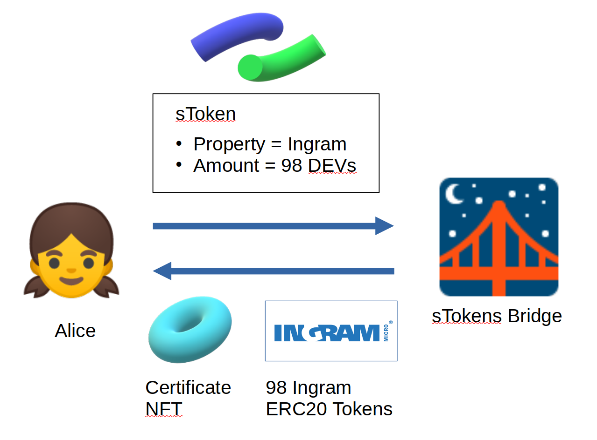

# What is sTokens Bridge? and How does it work?
Hi, I am Ikeda and have been a developer in Dev protocol since September.
In this article, I will introduce a new contract, sTokens Bridge, which I have been developing recently.
The sTokens Bridge is not released yet (The source is here [github sTokensBridge](https://github.com/dev-protocol/s-tokens-bridge) ),
but in this article I will explain what this new contract will achieve in the future.

## Overview
The sTokens Bridge is a contract, where sTokens-holders deposit their sTokens and get new ERC20 tokens in return.
The bridge gives a sToken holder as much amount of ERC20 tokens as he/she staked 
(To know what sToken is, see this article: [sTokens, NFTs mirroring DEV staking](https://medium.com/devprtcl/stokens-nfts-mirroring-dev-staking-b41f93d0f8a6).
The sToken is an NFT which is the certificate of staking).

Creators of OSS projects can offer benefits to sToken holders, 
and by doing so, the creators can give stakers an incentive for long-term staking.
The new contract, sTokens Bridge, transforms sTokens into ERC20 tokens.
By this transformation, 
the Bridge makes creator's benefit-offering more flexible and decentralized, thus it helps the OSS community grow.

## Why is the sTokens Bridge necessary?
Here let us assume a situation where Alice stakes 98 DEVs in the Property "Ingram".
By this staking, Alice gets an NFT called sToken
which has the following information: Property = Ingram, StakingAmount = 98 DEVs.
When Ingram creators want to offer benefits to Alice,
they have to check if Alice has a sToken whose property is Ingram,
and furthermore they need to know how much amount of DEV Alice is staking most of the time.

Now let us assume that the creators are trying to develop Dapps, where Alice can take benefits from her sToken.
In such Dapps, developers need to read the inner information of Alice's sToken. 
However, to get the inner information,
they have to check the source code of the sToken contract,
that is, they have to develop Dapps to meet the unique specification of the sToken.

Isn't it a really bad idea that developers have to write codes customized only for the sToken's unique specification?
That's why we'll introduce the sTokens Bridge.
When Alice deposits her sToken into the sTokens Bridge,
she gets a certificate of staking and 98 Ingram ERC20 tokens which represents her staking amount.

What would it be like if Alice could use this ingram token instead of sToken itself?
In that case, the developers no longer need to read the inner information of the sToken.
Instead they only need to check Alice's balance of Ingram tokens.
That is, the developers can use the ERC20 interface which is really standard and easy to develope with.
This clearly shows the sTokens Bridge improves the composability of sToken.

## An example of application
An example of the Bridge application is the community governance.
Such a Dapp is already developed actually.
[Snapshot](snapshot.org) is a Dapp where users can vote by using ERC20 tokens as their voting right.
In the use case like Snapshot we can use the Bridge tokens.
That is, OSS creators can give each staker voting right share which is proportional to one's Bridge token balance.
In this way the creators can make decisions about their project while respecting their supporters.

## Conclusion
sTokens can provide OSS creators with an opportunity to offer benefits to stakers,
but it is sometimes inconvenient to check the staking amount of each staker.
The sTokens Bridge can solve this inconvenience by transforming the sTokens into ERC20 tokens which is really standard and easy to develop with.
By introducing the sTokens Bridge, benefits-offering will be more active,
thus that would bring about the further growth of DEV community.

