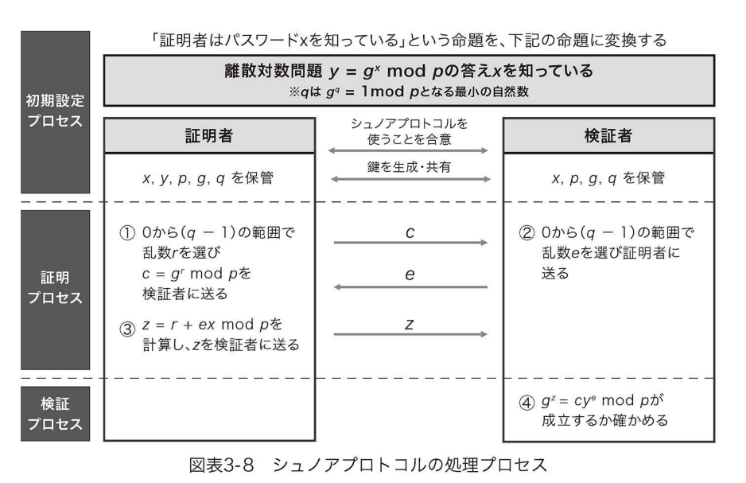

# ゼロ知識証明3章のまとめ

## ゼロ知識証明とは
ゼロ知識証明とは、証明者が検証者に、
自分の持っている命題が真であることを伝えるのに、真であること以外、
何の知識も伝えることなく証明できるようなプロトコルである。
近年、ブロックチェーンの普及により、ゼロ知識証明が注目されるようになった。
ブロックチェーン上では、トランザクションはすべて公開されており、誰がいつ、いくらの金額を誰に送金したかというプライベートな情報が全世界に公開されている。
そのためブロックチェーン上のお金のやりとりには一般的にプライバシーがない。
ところが、ゼロ知識証明を用いると、送金内容そのものは秘匿しながら、トランザクションの正当性を検証できる。
すなわちトランザクションが真であるという命題を、それが真であること以外の何の知識も公開することなくブロックチェーンを利用できるようになる。

## ゼロ知識証明の3つの特性
ゼロ知識証明は以下の、完全性、健全性、ゼロ知識性の３つの特性を備えている。
- 完全性：検証者は証明者が持っている命題が真である場合、真であることが必ずわかる
- 健全性：検証者は証明者が持っている命題が偽である場合、高い確率でそれが偽とわかる
- ゼロ知識性：検証者が証明者から知識を盗もうとしても「命題が真である」こと以外何の知識も得ることができない

## ゼロ知識性を持たない知識の証明
証明者Aliceと検証者Bobが24071という知識を共有している場合を考える。
Aliceは、Bobに正しい知識24071を持っていることを証明したい。
Aliceが知識を直接Bobに教えることなく、知識を証明するためには、ハッシュ関数を用いる方法が考えられる。
Aliceは知識24071をそのままBobに教えるのではなく、24071をハッシュ化した数値をBobに伝える。
BobがAliceと同じ知識24071を持っていれば、Bobのハッシュ値もAliceのハッシュ値と同じになるので、BobはAliceが正しい知識を持っていることを検証できる。

この検証は、ゼロ知識証明の3つの特性のうち、完全性と健全性を満たすが、ゼロ知識性は満たさない。完全性については、もしAliceが正しい知識を持っていれば、AliceとBobのハッシュ値は必ず同じになるため、完全性を満たす。健全性については、Aliceが間違った知識を持っていた場合、ハッシュ値が同じになる可能性は極めて低いため、健全性も満たす。しかしながら、Aliceはハッシュ値を検証者に渡しているため、ハッシュという知識を検証者に渡してしまっている。そのため、ゼロ知識性を満たさない。もし検証者が偽物であれば、Aliceは知識を偽の検証者（システムの攻撃者）に盗まれてしまう。

## ゼロ知識証明の例（シュノアプロトコル）
シュノアプロトコルでは、証明者が知識xを持っているという命題を、離散対数問題
$$ y = g^x\ \mathrm{mod}\ p $$
の解xを知っているという命題に変換する。
p（素数）とgが十分に大きいとき、離散対数問題の解xを求めることは極めて難しい。
シュノアプロトコルでは、知識xを明らかにすることなく、離散対数問題の解を知っているという事実のみを検証者に証明する。

シュノアプロトコルでは、証明者と検証者は事前に必要なパラメータx, y, p, g, qの組を共有しておく。
証明者は乱数rを選び、乱数rを用いて計算したc = g^r mod pを検証者に送る。
一方、検証者も独自に乱数eを選び、証明者に送る。
証明者は乱数eを受け取ると、2つの乱数r, eから計算されるz = r + e*x mod pを検証者に送る。
最終的に検証者は離散対数問題g^z = cy^e mod pが成立することを検証する。

※画像は参考文献[1]から

シュノアプロトコルでは、証明者が正しい知識を持っていれば、離散対数問題g^z = cy^e mod pは必ず成立するため、完全性を満たす。
健全性については、検証者が任意に乱数eを選択するため、証明者が知識xを持っていない場合、離散対数問題をパスするc, e, zの組み合わせを見つけることは極めて難しい。
よって健全性を満たす。
ゼロ知識性については、証明者は乱数によってマスクされた値のみを検証者に渡しているため、知識xについてのいかなる情報も検証者に漏れておらず、ゼロ知識性を満たす。

## ゼロ知識証明のブロックチェーンへの応用 zk-SNARK
ゼロ知識証明が初めて応用されたブロックチェーンとして、ZCashがある。
ブロックチェーンは、送金情報や個人の資産情報がすべて公開されしまうデメリットがあった。しかしZCashはゼロ知識証明の方法の一つzk-SNARKを用いて、プライベート情報を秘匿して、トランザクションを検証できる。
zk-SNARKは「Zero Knowledge – Succinct Non-interactive Argument of Knowledge」の略である。

Succinctとは、証明したい命題がいかに複雑でも、証明者が検証者に送る証明のサイズが一定である特徴を指す
(シュノアプロトコルの例では証明のサイズは、z= r + ex mod pのサイズに相当)。
簡単に言えば、zk-SNARKは証明のサイズが小さいという利点を持つ。
ブロックチェーンでは、ブロックに保存できる情報のサイズには限りが在るため、証明サイズは小さいほど好ましい。

Non-interactiveとは、非対話型の意味で、証明者と検証者の間でデータのやり取りをする必要がない。
シュノアプロトコルは、c, eという乱数を証明者と検証者の間で送り合う必要があるため、対話型のゼロ知識証明である。
zk-SNARKは、非対話型のため、ブロックチェーンのような非同期システムでも運用可能である。

最後のARK(argument of knowledge)は、証明の検証に必要な計算量が小さいという特徴を指す。
ブロックチェーンでは、計算量が小さいほどトランザクション手数料が小さくなるので、ARKはブロックチェーン上で運用する際は利点となる。

zk-SNARKの欠点として、証明に使用する乱数が信頼できる第三者機関を必要とする点が挙げられる。
シュノアプロトコルでは、乱数r, eは証明者と検証者がそれぞれ独自に用意したが、zk-SNARKでは乱数の提供は証明者と検証者から独立した第三者機関によって行われる。
よって、この第三者機関が本当に信頼できるかどうかのセキュリティ上の問題は残る。

## スケーラブル性、透過性を有したzk-STARK
zk-SNARKの次に注目されている方法として、zk-STARKがある。
zk-STARKは「Zero Knowledge - Scalable Transparent Argument of Knowledge」の略である。

Scalable性は、計算時間が増加しないという特性で、zk-SNARKに比べ、計算時間が短くなるという利点が在る。
一方でzk-SNARKが持っていたSuccinct性は持たないため、証明サイズは多くなるというデメリットが在る。

Transparent性（透明性）は、検証に利用する乱数の生成規則が公開されており、乱数生成のための第三者機関が必要ないことを意味する。
よってzk-SNARKの欠点が解決されている。

zk-STARKはzk-SNARKよりも新しい技術であり、現在、ブロックチェーンのスケーラビリティ向上を目的とし、研究開発が進められている。

zk-SNARK、zk-STARKの違いは以下の表にまとめられる
(Bullet proofについての説明は本記事では省略)。

※画像は参考文献[1]から

## 結論
ブロックチェーン上でのプラバシー保護のため、ゼロ知識証明が注目されている。
ゼロ知識証明の中でも、非対話型のzk-SNARK, zk-STARKなどがブロックチェーン上での実装に適しており、研究開発が進めらている。zk-SNARKはすでにZ-Cashで応用されており、さらにスケーラビリティ向上のためzk-STARKの研究開発も現在進んでいる。
## 参考文献
[1]ゼロ知識証明入門 有限責任監査法人トーマツ (著)

[2]ゼロ知識証明(ZKPs)、およびzk-SNARKとzk-STARKの概要
https://hashhub-research.com/articles/2020-01-16-about-zkps